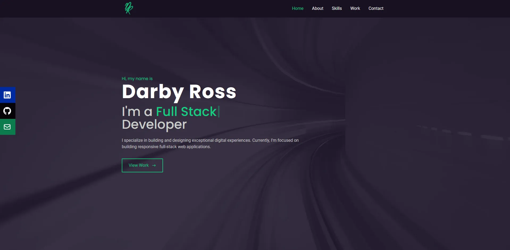
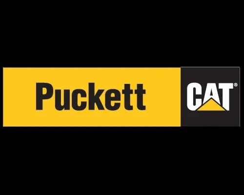
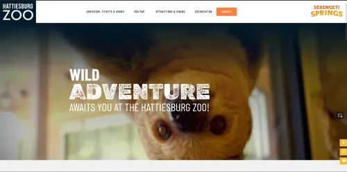
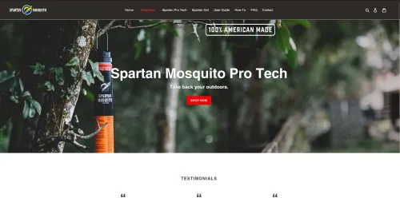

# My Portfolio

Welcome to my personal portfolio landing page! This is where you can learn more about me, my skills, and view some of the projects I've worked on as a web developer.

## About Me

I'm Darby Ross, a passionate web developer with a love for creating web applications and solving real-world problems through code. I'm dedicated to creating responsive and user-friendly websites.

## What I Do

I specialize in the following:

- **Web Development**: I create stunning and interactive web applications using modern web technologies such as HTML, CSS, and JavaScript.

- **Frontend Development**: I design and build intuitive user interfaces with React.js and other frontend libraries and frameworks.

- **Backend Development**: I develop server-side logic and APIs with Node.js, Express, and databases like MongoDB.

- **Responsive Design**: Ensuring that websites look and function flawlessly on all devices is a priority for me.

## Projects

Here are some of the projects I've worked on:

### Puckett Machinery Inventory Management System

This comprehensive system, built on a technology stack comprising JavaScript, .NET, and T-SQL, delivered the following key features:

    Efficient Inventory Tracking: I designed and implemented a robust inventory tracking system using JavaScript, allowing Puckett Machinery to monitor stock levels, manage product information, and track item movements seamlessly.

    Scalable Backend with .NET: Leveraging the power of the .NET framework, I developed the backend of the system. This included crafting APIs, building authentication mechanisms, and establishing secure data storage and retrieval processes.

    Database Management with T-SQL: I architected and managed the system's database using T-SQL, creating optimized data structures and queries for efficient inventory management and reporting.

This Inventory Management System empowered Puckett Machinery to streamline its operations, enhance inventory control, and achieve a higher level of efficiency and accuracy in managing its vast range of equipment and parts.

### Hattiesburg Zoo Ticketing System

This project leveraged a tech stack consisting of JavaScript, .NET, and T-SQL to deliver the following key functionalities:

    Seamless Ticket Booking: I designed and implemented an intuitive frontend using JavaScript, providing visitors with a user-friendly platform to book tickets for the Hattiesburg Zoo conveniently.

    Robust Backend with .NET: Leveraging the .NET framework, I developed a robust backend that facilitated ticket processing, order management, and secure payment handling. This included the creation of APIs, user authentication, and data storage mechanisms.

    Efficient Data Management with T-SQL: To support the ticketing system's operations, I utilized T-SQL for database management. This allowed for efficient data storage, retrieval, and reporting capabilities.

This ticketing system has significantly improved the visitor experience at the Hattiesburg Zoo, making it easier for guests to plan their visits and enjoy the zoo's attractions.

### Spartan Mosquito E-commerce site

My role in software development for Spartan Mosquito's e-commerce website was instrumental in creating a robust platform that enhances the company's online presence and streamlines the sales process for their mosquito repellent products. Leveraging a technology stack comprising JavaScript, .NET, T-SQL, and Stripe integration, I contributed to the following key aspects:

    Responsive and User-Friendly Frontend: I designed and implemented a responsive frontend using JavaScript, ensuring that visitors could seamlessly browse Spartan Mosquito's products, add items to their cart, and complete transactions with ease.

    Scalable Backend with .NET: The e-commerce website's backend, powered by the .NET framework, provided a scalable foundation. It encompassed essential functionalities such as product management, inventory tracking, order processing, and user account management.

    Secure Payment Processing with Stripe: Integration with Stripe ensured secure and efficient payment processing, allowing customers to make online payments for their purchases confidently.

    Database Management with T-SQL: T-SQL was employed for efficient database management, enabling Spartan Mosquito to organize and retrieve product information, customer data, and order histories seamlessly.

The Spartan Mosquito e-commerce website now offers a seamless shopping experience to customers seeking effective mosquito repellent solutions. It has played a pivotal role in expanding the company's online reach and enhancing customer satisfaction.

## Get In Touch

I'm always open to new opportunities and collaborations. If you have a project in mind, want to chat about web development, or just want to say hi, feel free to reach out to me:

- [Email](mailto:darbyross.dev@gmail.com)
- [LinkedIn](https://www.linkedin.com/in/darby-ross)
- [GitHub](https://github.com/rossd84)

## Let's Build Together

If you're looking for a skilled web developer to bring your project to life or want to collaborate on exciting ideas, I'd love to hear from you. Let's create something amazing together!